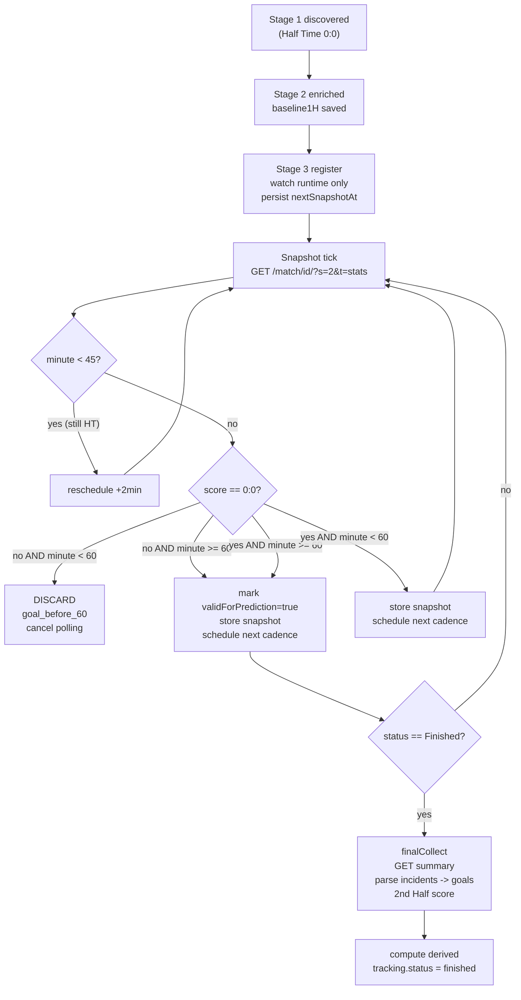

# Stage 3 — Live Snapshot Tracker

**Status:** Implemented
**Depends on:** Stage 1 (`raw_candidates.json`), Stage 2 (`enrichment.json` → `baseline1H`)

Кожен enriched-кандидат (`Half Time` 0:0) переходить у фазу live-моніторингу: збір snapshot-ів статистики від **45'** і далі кожні **5 хвилин** (`45/50/55/60/...`) до Finished або discard. Вихід — `data/logs/YYYY-MM-DD/matches.json` як єдиний агрегований dataset для майбутньої моделі прогнозування **TM/TB 0.5 у вікні 60–75 хв**.

---

## Головна ідея

```
discovered (Stage 1)
     │
     ▼
enriched   (Stage 2)         ← baseline1H зафіксовано
     │
     ▼
tracked    (Stage 3)         ← snapshot кожні 5 хв
     │
     ▼
finished   (Stage 3)         ← final score + goals + derived
```

Матч валідний для прогнозу TM/TB 0.5, якщо до **60-ї хвилини** рахунок **0:0**. Якщо гол забили раніше — матч відкидаємо (`discardReason: "goal_before_60"`). Якщо рахунок 0:0 на 60' — продовжуємо збір до кінця матчу для аналізу як TM-, так і TB-сценарію.

---

## Архітектурні рішення

| Аспект | Рішення |
|---|---|
| **Trigger** | `trackingScheduler.register()` викликається тільки в primary runtime (`npm run watch`) після успішного `saveEnrichment` для нових `status === 'enriched'` записів |
| **Polling** | `setTimeout`-driven per-match registry; перший snapshot стартує від halftime cadence, а не від `discoveredAt + 18 min`; далі кожні **5 хв** до Finished |
| **HTTP per snapshot** | **1 GET** на `/match/{id}/?s=2&t=stats` — звідти ж score (`#main .detail`), minute/status, та cumulative stats (feed) |
| **Concurrency** | `p-limit(2)` для одночасних snapshot-ів + `±15s` jitter при register щоб уникнути burst-ів |
| **2H stats** | `since2H = cumulative − baseline1H` (математично, без додаткового запиту) |
| **Delta** | `delta = currentSnapshot.cumulative − previousSnapshot.cumulative`; `null` для першого snapshot |
| **Possession** | без дельти — фіксуємо тільки актуальне значення на момент snapshot (це відсоток, не накопичення) |
| **Discard policy** | score ≠ 0:0 AND minute < 60 → `tracking.status = "discarded"`, polling зупиняється |
| **Validity flag** | `tracking.validForPrediction = true` коли вперше зустріли minute ≥ 60 з рахунком 0:0 |
| **Final trigger** | `header.status === "Finished"` → один останній GET summary → goals[] + final score → derived |
| **Storage** | `data/logs/YYYY-MM-DD/matches.json`, keyed by `matchId` — об'єднує candidate + enrichment + snapshots + final + derived |
| **Restart safety** | `trackingScheduler.resume()` на старті процесу: читає matches.json і re-schedule всіх `tracking.status === "active"`; `tracker-resume` використовується тільки як recovery/failover |
| **Hard timeout** | 120 хв від `discoveredAt` без Finished → `tracking.status = "stale"` |
| **Halftime retry** | якщо HTTP-відповідь показує `Half Time` / `minute < 45` → reschedule на +2 хв |

---

## Lifecycle одного матчу



---

## Pipeline (per snapshot tick)

```
GET /match/{id}/?s=2&t=stats        ← один HTTP-запит
   │
   ├─ liveHeaderParser($)
   │    #main .detail <b>0:0</b>     → scoreHome, scoreAway
   │    #main .detail (наступний)    → minute / status ("67'", "Half Time", "Finished")
   │
   ├─ matchStatsParser(html)
   │    feed[Match] (cumulative)     → home, away (повна стата матчу)
   │
   ├─ discardPolicy
   │    if (goals > 0 && minute < 60) → DISCARD, cancel scheduler
   │
   ├─ deltaCalculator
   │    since2H = cumulative − baseline1H
   │    delta   = cumulative − previousSnapshot.cumulative   (null для першого)
   │
   ├─ matchStore.appendSnapshot(matchId, snapshotRecord)
   │
   └─ if (status === "Finished") → finalCollector
                                else → scheduleNext(+5min ± jitter)
```

---

## Module layout

```
src/tracker/
  trackingScheduler.js       — per-match setTimeout registry; restart-safe resume()
  snapshotCollector.js       — orchestrate one snapshot tick (1 GET → parse → store)
  finalCollector.js          — final pass: goals[] + final score + derived fields
  discardPolicy.js           — score ≠ 0:0 AND minute < 60 → discard
  deltaCalculator.js         — pure: subtract numeric stats (skip percentages)
  derivedFields.js           — pure: marketSignal, tableSignal, oddsImpliedOver25
  parsers/
    liveHeaderParser.js      — #main .detail → { score, minute, status }
    incidentParser.js        — #detail-tab-content → goals[] (h4 2nd Half + i-field icon ball)

src/store/
  matchStore.js              — read/upsert matches.json (per matchId merge)

src/orchestrator/
  runWatch.js                — canonical runtime: trackingScheduler.start() + resume()
  runOnce.js                 — one cycle only; без штатного snapshot lifecycle

scripts/
  tracker-resume.js          — manual recovery/failover only
```

---

## `matches.json` Schema

```json
{
  "OfvqEnzG": {
    "matchId": "OfvqEnzG",

    "country":   "CHINA",
    "league":    "Super League",
    "homeTeam":  "Liaoning Tieren",
    "awayTeam":  "Chengdu Rongcheng",
    "matchUrl":  "/match/OfvqEnzG/?s=2",
    "discoveredAt": "2026-05-07T13:35:00Z",
    "enrichedAt":   "2026-05-07T13:36:14Z",

    "odds": { "home": 4.53, "draw": 4.30, "away": 1.63, "isOddsFavorite": { "favorite": "away", "margin": 0.17, "threshold": 1.8 } },
    "statsLevel": "detailed",

    "baseline1H": {
      "totalShots":       { "home": 5,  "away": 17 },
      "shotsOnTarget":    { "home": 1,  "away": 5  },
      "cornerKicks":      { "home": 3,  "away": 10 },
      "expectedGoalsXg":  { "home": 0.39, "away": 1.39 },
      "ballPossession":   { "home": 31, "away": 69 },
      "yellowCards":      { "home": 0,  "away": 0  },
      "redCards":         { "home": 0,  "away": 0  }
    },

    "standings": { "..." : "як зараз у Stage 2" },
    "h2h":       { "..." : "як зараз у Stage 2" },

    "tracking": {
      "status": "finished",
      "discardReason": null,
      "validForPrediction": true,
      "firstGoalMinute": 63,
      "nextSnapshotAt": null,
      "snapshotCount": 9,
      "failureCount": 0
    },

    "snapshots": [
      {
        "minute": 47,
        "capturedAt": "2026-05-07T14:05:12Z",
        "status": "2nd Half",
        "scoreHome": 0,
        "scoreAway": 0,
        "ballPossession": { "home": 33, "away": 67 },
        "cumulative": {
          "totalShots":      { "home": 6, "away": 18 },
          "shotsOnTarget":   { "home": 1, "away": 6  },
          "cornerKicks":     { "home": 3, "away": 11 },
          "expectedGoalsXg": { "home": 0.42, "away": 1.55 },
          "yellowCards":     { "home": 0, "away": 1 },
          "redCards":        { "home": 0, "away": 0 }
        },
        "since2H": {
          "totalShots":      { "home": 1, "away": 1 },
          "shotsOnTarget":   { "home": 0, "away": 1 },
          "cornerKicks":     { "home": 0, "away": 1 },
          "expectedGoalsXg": { "home": 0.03, "away": 0.16 },
          "yellowCards":     { "home": 0, "away": 1 },
          "redCards":        { "home": 0, "away": 0 }
        },
        "delta": null
      },
      {
        "minute": 52,
        "capturedAt": "2026-05-07T14:10:08Z",
        "status": "2nd Half",
        "scoreHome": 0, "scoreAway": 0,
        "ballPossession": { "home": 38, "away": 62 },
        "cumulative": { "...": "..." },
        "since2H":    { "...": "..." },
        "delta": {
          "totalShots":      { "home": 2, "away": 3 },
          "shotsOnTarget":   { "home": 1, "away": 1 },
          "cornerKicks":     { "home": 1, "away": 0 },
          "expectedGoalsXg": { "home": 0.15, "away": 0.22 },
          "yellowCards":     { "home": 0, "away": 0 },
          "redCards":        { "home": 0, "away": 0 }
        }
      }
    ],

    "final": {
      "scoreHome": 0,
      "scoreAway": 1,
      "totalGoals": 1,
      "resultTM05": false,
      "resultTB05": true,
      "firstGoalMinute": 63,
      "goalsAfter60": 1,
      "goalsAfter75": 0,
      "goals": [
        { "minute": 63, "team": "away", "isExtraTime": false }
      ],
      "finishedAt": "2026-05-07T14:52:00Z"
    },

    "derived": {
      "p1Clean": 0.199,
      "pXClean": 0.210,
      "p2Clean": 0.553,
      "marketSignal": -0.354,
      "tableSignal": null,
      "oddsImpliedOver25": null
    }
  }
}
```

### Status enum (`tracking.status`)

- `active` — snapshot polling триває
- `finished` — final зафіксовано, dataset complete
- `discarded` — гол до 60' (не валідний для прогнозу)
- `stale` — hard timeout або 3+ помилки підряд (потребує manual review)

---

## Парсери

### `liveHeaderParser.js`

Парсить блок `#main` зі сторінки `/match/{id}/?s=2&t=stats`:

```html
<div id="main" class="soccer">
  ...
  <h3>Liaoning Tieren - Chengdu Rongcheng</h3>
  <div class="detail"><b>0:1</b>  (0:0,0:1)</div>
  <div class="detail">Finished</div>
  <div class="detail">05.05.2026 13:35</div>
  ...
</div>
```

API:
```javascript
parseLiveHeader(html) → {
  scoreHome: number,
  scoreAway: number,
  minute: number | null,        // 67, 90, null якщо HT/Finished
  status: string,               // "1st Half" | "2nd Half" | "Half Time" | "Finished" | "67'"
  isFinished: boolean,
  isHalftime: boolean,
}
```

### `incidentParser.js`

Парсить блок `#detail-tab-content` для виявлення голів:

```html
<h4>2nd Half: <b>0:1</b></h4>
<div class="incident soccer">
  <p class="i-field time">63'</p>
  <p class="i-field icon ball">&nbsp;</p>
  Player Name [TEAM_CODE]
</div>
```

Правила:
- `<h4>2nd Half: <b>X:Y</b></h4>` → score за 2H (= final, бо 1H завжди 0:0 у наших кандидатів)
- `<p class="i-field icon ball">` → подія "гол"
- `<p class="i-field time">63'</p>` → звичайний час, `isExtraTime: false`
- `<p class="i-field time-wide">90+4'</p>` → додатковий час, `isExtraTime: true` (хвилина зберігається як `90`, додатково `extraMinutes: 4`)
- `[CODE]` після імені визначає команду; матчимо проти codes з `homeTeam`/`awayTeam` (або беремо position в incident list як fallback)

API:
```javascript
parseIncidents(html) → {
  secondHalfScore: { home: 0, away: 1 },
  goals: [
    { minute: 63, extraMinutes: 0, team: "away", isExtraTime: false },
    { minute: 90, extraMinutes: 4, team: "home", isExtraTime: true }
  ]
}
```

---

## Calculators

### `deltaCalculator.subtractStats(a, b)`

Pure-функція: `a − b` для всіх числових полів (totalShots, shotsOnTarget, cornerKicks, xG, yellowCards, redCards).

- xG-поля з `null` (basic statsLevel) → результат `null`
- Не торкається `ballPossession` (він не накопичувальний)
- Структура збережена: `{ totalShots: { home: 2, away: 3 }, ... }`

### `derivedFields.compute(match)`

Викликається один раз у `finalCollector` після фіналізації. Повертає блок `derived`:

```javascript
function compute(match) {
  const { home, draw, away } = match.odds || {};
  const margin = (home && draw && away) ? (1/home + 1/draw + 1/away) : 0;

  return {
    p1Clean: margin ? (1/home) / margin : null,
    pXClean: margin ? (1/draw) / margin : null,
    p2Clean: margin ? (1/away) / margin : null,
    marketSignal: (home && away)
      ? clamp(((1/home) - (1/away)) / margin, -1, 1)
      : null,
    tableSignal: computeTableSignal(match.standings),    // clip(ppg_diff/2, -1, 1)
    oddsImpliedOver25: null,                              // ще не парсимо over-2.5 odds
  };
}
```

---

## ENV (Stage 3)

```bash
LIVE_TRACKER_ENABLED=1
LIVE_TRACKER_CONCURRENCY=2
LIVE_TRACKER_FIRST_SNAPSHOT_OFFSET_MS=1080000   # 18 хв після discoveredAt
LIVE_TRACKER_INTERVAL_MS=300000                 # 5 хв між snapshot
LIVE_TRACKER_JITTER_MS=15000                    # ±15 с при кожному schedule
LIVE_TRACKER_HALFTIME_RETRY_MS=120000           # +2 хв якщо все ще HT
LIVE_TRACKER_HARD_TIMEOUT_MS=7200000            # 120 хв від discoveredAt
LIVE_TRACKER_MAX_FAILURES=3                     # порог для → "stale"
LIVE_TRACKER_DISCARD_BEFORE_MINUTE=60
LIVE_TRACKER_VALID_FROM_MINUTE=60
```

---

## Display (extended `runOnce` output)

```
Tracking (4 active):
  ~  OfvqEnzG  @ 67'  0:0   shots:6/18    xG:0.42/1.55   next: 72' (4:23)
  ~  GS3Jfzrf  @ 52'  1:0   DISCARDED  (goal_before_60)
  ~  ABCdef12  @ 90'  0:1   valid       next: final
  ~  XYZ123    @ 47'  0:0   shots:1/2                  next: 52' (1:12)
```

---

## Команди

```bash
npm run watch              # discovery + enrichment + tracker (continuous)
npm run parse              # single tick: discovery + enrichment + register
npm run tracker:resume     # re-scan today's matches.json (recovery)
```

---

## Edge cases

| Випадок | Обробка |
|---|---|
| **Basic statsLevel** | xG-поля = `null`; since2H/delta xG = `null`; pressureIndex не рахуємо |
| **`45+'` замість `Half Time`** | той самий код-шлях через `isHalftimeStatus()` |
| **Гол у extra time (90+X)** | `isExtraTime: true`; `goalsAfter75` рахує 76–90'; голи 90+X враховуються для `totalGoals` але не додаються до `goalsAfter75` |
| **Status `Finished` на ранньому snapshot** (60-65') | означає cancel/postponement → `tracking.status = "stale"` |
| **HTTP fail** | retry через існуючий `fetchResilient`; якщо все одно fail → `failureCount++`, reschedule +2min; після `MAX_FAILURES` → `stale` |
| **Hard timeout** | від `discoveredAt + 120min` без Finished → `stale` |
| **Process restart** | `tracker:resume` читає matches.json, re-schedule всіх `active` |
| **Score change без нового goal incident** | rare — використовуємо score з header як ground truth, голи парсимо з incidents окремо для аналітики |
| **Two snapshots зі своєю score change** | гол визначається по first occurrence де `scoreHome+scoreAway > 0`; саме на цьому snapshot встановлюємо `firstGoalMinute = header.minute` |

---

## Що далі (Stage 4)

Після збору достатнього dataset (рекомендовано ≥ 200 matches з `validForPrediction: true`):

- **Feature engineering** — pressure_index, momentum, xG-trend для вікна 60–75'
- **Model training** — logistic regression / GBT для P(TM 0.5 в 60–75')
- **Backtest** — replay matches.json через модель, ROI calc на історичних коефах
- **Live prediction** — інтеграція в snapshotCollector: на 60' / 65' / 70' видавати ймовірності та (опційно) Telegram-сигнал
